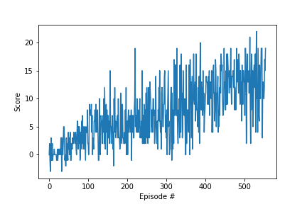

# Project 1: Navigation

### Implementation

Description of implementation.

### Learning Algorithm

Description of learning algorithm, chosen hyperparameters and architecture of neural network. 

### Plot of Rewards

After 555 episodes, the successful agent was able to achieve an average score of +13 over its last 100 episodes.

### Ideas for Future Work
